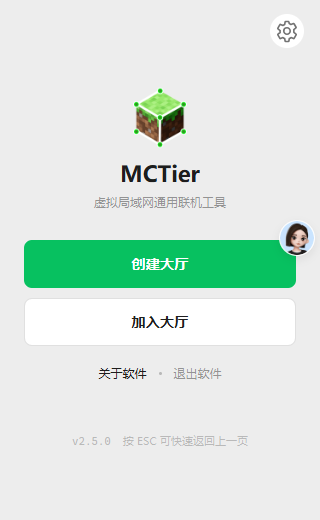
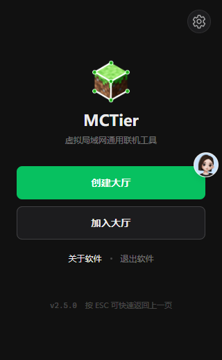
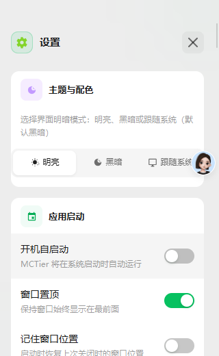
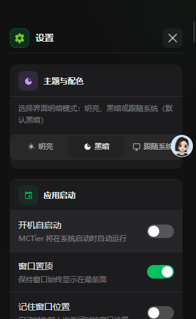
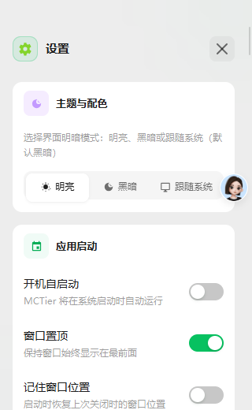
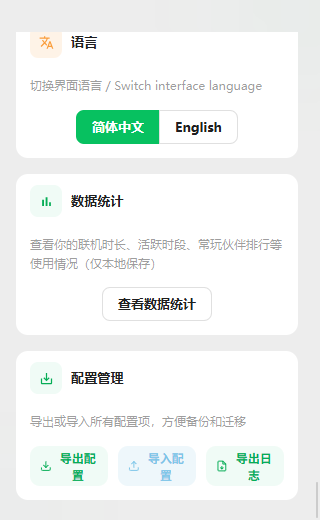
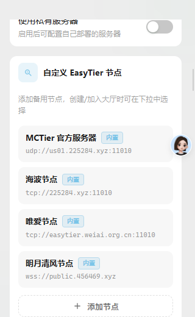
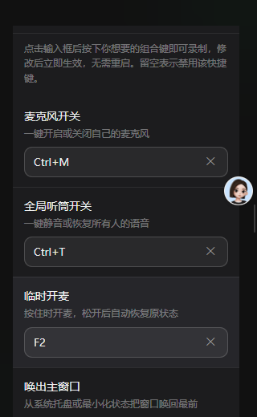
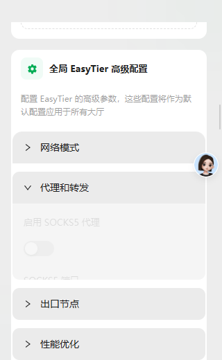
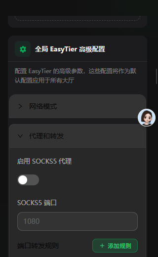

<div align="center">
  

  # MCTier

  **A universal virtual-LAN networking tool**

  <p>
    
    
    
    
  </p>


  **Supports Windows 10/11 and Android. Desktop and mobile can join the same lobby to form a cross-network virtual LAN.**

  [GitHub](https://github.com/TNTnext/MCTierPlus) · [Quick Start](#quick-start) · [Screenshots](#screenshots)

  English | [简体中文](./README.md)
</div>

---

## Overview

MCTier uses EasyTier and WebRTC to bring devices on different networks into one virtual LAN. LAN game multiplayer, access to local services on another machine, ad-hoc voice chat or file sharing — you can spin up a lobby for all of it.

Typical use cases include:

- LAN game multiplayer, such as Minecraft, Terraria, Don't Starve, and more.
- Cross-network access to local services, such as dev/debug pages, LAN admin panels, or temporary HTTP services.
- Ad-hoc small-team collaboration, such as voice channels, chat rooms, folder sharing and screen sharing.
- Linking phones and PCs, such as scanning a QR code to join a lobby or pasting an invite link.

## Screenshots

The UI follows a WeChat-style design, with light and dark themes that can also follow the system.

### Windows

<table>
  <tr>
    <td align="center" width="50%">
      <br>
      <b>Home (light)</b>
    </td>
    <td align="center" width="50%">
      <br>
      <b>Home (dark)</b>
    </td>
  </tr>
  <tr>
    <td align="center" width="50%">
      <br>
      <b>Settings (light)</b>
    </td>
    <td align="center" width="50%">
      <br>
      <b>Settings (dark)</b>
    </td>
  </tr>
  <tr>
    <td align="center" width="50%">
      <br>
      <b>Settings · Theme</b>
    </td>
    <td align="center" width="50%">
      <br>
      <b>Settings · Network</b>
    </td>
  </tr>
  <tr>
    <td align="center" width="50%">
      <br>
      <b>Settings · Nodes</b>
    </td>
    <td align="center" width="50%">
      <br>
      <b>Settings · Hotkeys</b>
    </td>
  </tr>
  <tr>
    <td align="center" width="50%">
      <br>
      <b>Advanced Network (light)</b>
    </td>
    <td align="center" width="50%">
      <br>
      <b>Advanced Network (dark)</b>
    </td>
  </tr>
  <tr>
    <td align="center" colspan="2">
      <br>
      <b>About (light)</b>
    </td>
  </tr>
</table>

## Core Features

### Networking & Connection

- **Virtual LAN networking**: Build a virtual network on EasyTier without a public IP.
- **Cross-platform lobbies**: Phones and PCs can join the same lobby; phone users can scan a QR code to get in.
- **Public lobby plaza**: Hosts can publish a lobby to the plaza, so strangers can find it and join directly.
- **Custom nodes & virtual domains**: Add your own EasyTier nodes and configure a custom domain for the virtual network.
- **Connection / network diagnostics**: Aggregate members' direct/relay status, latency and packet loss into a score with tuning tips; network diagnostics can also check the virtual adapter, firewall, UDP ports and security-software blocking, with one-click firewall allow.
- **Self-hosting**: Run your own signaling server so you control the connection entry.

### Communication & Collaboration

- **Real-time voice channels**: Voice by channel within a lobby, handy for collaboration.
- **Voice squads**: Split members into squads so you only hear teammates in your squad — easy grouped voice chat.
- **Built-in voice changer**: Real-time voice changing with presets like girl and uncle voices; preview before applying.
- **Lobby chat room**: Supports text, image and emoji messages.
- **Message danmaku**: Chat messages float across the top of the screen as bullets, so you never miss them while in the background or gaming; adjustable size, speed, opacity, tracks and color (including random rainbow), enabled by default.
- **Folder sharing**: Share folders with lobby members, with download and transfer lists.
- **Screen sharing**: View another member's screen via WebRTC.
- **Remote control**: Remotely view and operate another device in real time via WebRTC, supporting PC↔phone control in both directions; mouse move, left/right click, long-press, drag, wheel, keyboard input, and back/home/recents gestures are all there, and the window automatically picks landscape/portrait and size based on the remote resolution.
- **Room tools**: Built-in dice roller, countdown timer and a shared multi-user to-do list — great for tabletop games, draws and team task planning; the countdown keeps running even when you switch views or run in the background.

### Lobby Management & Convenience

- **Host management**: Hosts can post a scrolling announcement, set a member cap, kick members, and publish or unpublish to the public plaza.
- **Lobby QR code**: Join by scanning or copy the invite link.
- **Favorites & recents**: Save favorite lobbies for one-click fill, keep a history of recently joined lobbies and players you've played with, and save frequent teammates too.
- **Global hotkeys**: Customizable hotkeys supporting push-to-talk, one-key mute and more.
- **Mini overlay**: Quickly check member status, control voice and open tools on desktop.
- **In-game HUD overlay**: A pinned click-through overlay shows each teammate's latency, packet loss and who's talking while gaming, with mute, drag, opacity and scale controls.

### Gaming Enhancements

- **Minecraft world auto-discovery**: Scan Minecraft worlds opened by lobby members (MOTD/version/players/latency) and auto-inject them into your local LAN list to join without typing an IP.
- **Game quick connect**: Built-in port presets for common multiplayer games, auto-generating a "virtual IP:port" direct address to copy in one click.
- **Minecraft helper**: Detect the Minecraft install path and version, provide an illustrated LAN multiplayer guide, and automatically disable LAN online-mode verification for mainstream launchers.

### Advanced & More

- **EasyTier advanced network config**: Global and per-lobby advanced options (KCP/QUIC proxy, latency-first, P2P/hole-punching toggles), plus exit-node settings like SOCKS5 and port forwarding.
- **Local statistics**: Purely local stats for play time, join/host counts, active hours and a most-played-with ranking — never uploaded to any server.
- **Onboarding wizard**: On first launch, step through environment checks (permissions, firewall, security software) with one-click fixes.
- **Update detection**: Check for new versions on launch and prompt to update.

## Quick Start

### System Requirements

| Platform | Requirements |
| --- | --- |
| Windows | Windows 10/11 64-bit, 2GB+ RAM recommended |
| Android | Android phone or tablet, Android 8.0+ recommended |
| Network | Able to reach the configured EasyTier node and WebRTC signaling server |

### Download & Install

Download the latest build from [GitHub Releases](https://github.com/TNTnext/MCTierPlus/releases).

- Windows Installer: download `MCTier_x.x.x_x64-setup.exe` and double-click to install.
- Windows Portable: download `mctier.exe` and run it directly.
- Android: download `MCTier-Android.apk` and install it on your phone.

### Create or Join a Lobby

1. The host opens MCTier and chooses "Create Lobby".
2. Enter a lobby name, password and display name.
3. After creating, send the lobby QR code or invite link to other members.
4. Other members enter the lobby info or scan the QR code to join.
5. Once virtual IPs are assigned, you can access LAN services exposed by devices in the same lobby.

## Example: Minecraft Multiplayer

MCTier is a universal networking tool; Minecraft is just one typical use case.

After entering a singleplayer world, the host presses `Esc` and clicks "Open to LAN", then notes the port. Others choose "Direct Connect" and enter the host's virtual IP and port, for example:

```text
10.126.126.1:25565
```

If virtual domains are enabled, you can also connect with an address like `membername.mct.net:25565`.

## Self-hosting

If you want to host your own MCTier signaling server, the general flow is:

1. Prepare a Linux server or a host on your LAN.
2. Install Docker and Docker Compose.
3. Deploy a WebSocket signaling service (ws or wss, matching your client settings).
4. Set your private signaling address in the MCTier client settings.

## Development & Build

```bash
npm install
npm run tauri dev
npm run tauri build
```

The Android source code is located at:

```text
MCTier-Android/
```

Debug or package Android:

```bash
cd MCTier-Android
gradlew.bat assembleDebug
```

## License

This project uses a custom open-source license:

- For personal learning and non-commercial use only.
- Modification is allowed, but the original author's information must be retained.
- Derivative projects must be open-sourced under the same license.

## Disclaimer

- MCTier is a **neutral virtual-LAN networking and collaboration tool**, intended only for lawful personal use in compliance with the laws of your jurisdiction (e.g., LAN gaming, collaboration, accessing your own or authorized services).
- Communication content (chat, voice, files, screen, remote control, etc.) is transmitted **peer-to-peer directly** between members' devices; the developer does not participate in, control, or audit any user content or specific conduct.
- **Users are solely responsible for all their use and transmitted content.** Using the project for any unlawful activity is strictly prohibited, including but not limited to: unlicensed commercial/cross-border networking, spreading illegal or infringing content, unauthorized control or monitoring of others' devices, or using voice/voice-changer for fraud or impersonation.
- Sensitive features such as remote control, screen sharing and the voice changer require the user's **explicit in-app agreement to the corresponding notices and terms** before use, with risk and prohibition disclosures provided.
- The software is provided "as is" without any warranty; to the maximum extent permitted by law, the developer is not liable for any direct or indirect loss arising from its use.
- If you do not agree with any of the above, do not download, install or use the project. See the in-app User Agreement, Privacy Policy and Disclaimer for details.

## Author

Tnt-next

- Bilibili: <https://space.bilibili.com/3546659195718047>
- GitHub: <https://github.com/TNTnext/>

---

<div align="center">
  <sub>Modified from MCTier by <a href="https://github.com/pmh1314520/">https://github.com/pmh1314520/</a></sub>
</div>
